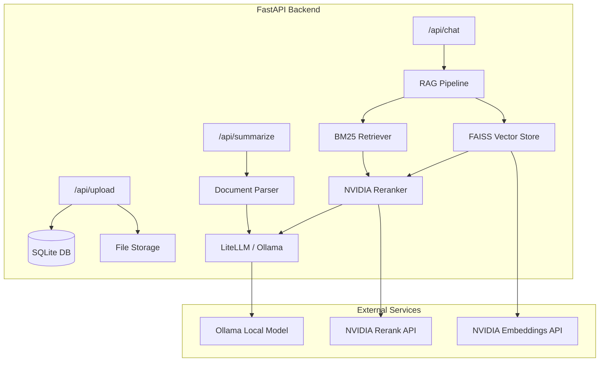
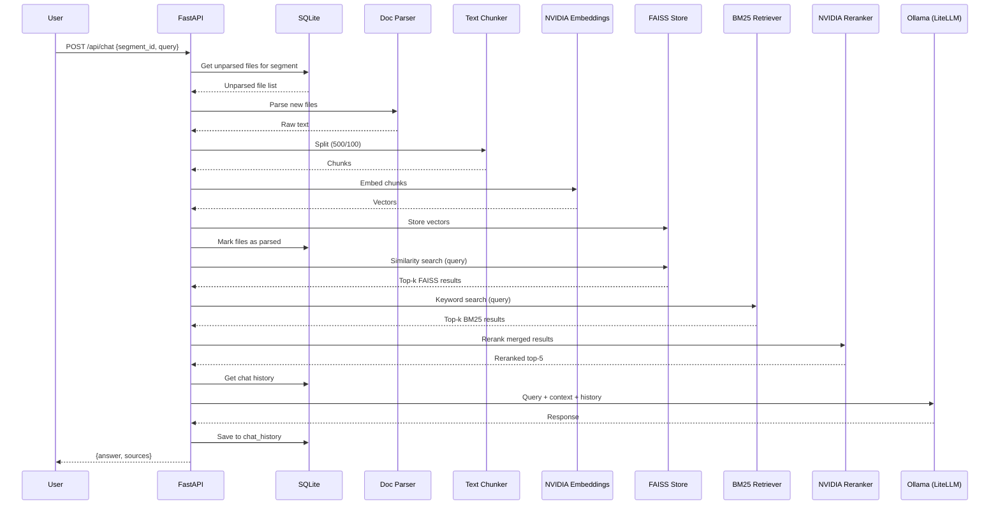

# MedGPT — FastAPI Medical Report Summarization & RAG Chatbot

A FastAPI backend with three core endpoints: file upload with segment-based grouping, medical report summarization, and a RAG-based chatbot — all powered by NVIDIA AI endpoints, LangChain, LiteLLM, and Ollama.

---

## Architecture Overview



---

## User Review Required

> [!IMPORTANT]
> **Ollama Model Selection**: The plan uses `ollama/llama3.1:8b` via LiteLLM as the default LLM. Please confirm which Ollama model you have installed or want to use (e.g., `llama3`, `mistral`, `gemma2`, `qwen2`, etc.).

> [!IMPORTANT]
> **API Key Security**: Your NVIDIA API key (`nvapi-paDfGGO-...`) is included. I will store it in a `.env` file (git-ignored). Confirm this is acceptable, or if you prefer a different secret management approach.

> [!WARNING]
> **Python 3.13 Compatibility**: Some dependencies (notably `faiss-cpu`) may have limited Python 3.13 support. If issues arise during install, we may need to use Python 3.11 or 3.12. I'll attempt 3.13 first.

---

## Open Questions

1. **Which Ollama model** do you have installed locally? (Default: `llama3.1:8b`)
2. **Summarization prompt**: Should the medical summary follow a specific template (e.g., Chief Complaint → Diagnosis → Treatment Plan → Medications)? Or a free-form summary?
3. **Max file size limit** for uploads? (Default: 50MB)
4. **Chat history**: Should the chatbot maintain conversation history per session, or is each query independent?

---

## Proposed Changes

### Project Structure

```
d:\Projects\Personal\Freelance-manik\
├── main.py                    # FastAPI app entry point
├── pyproject.toml             # Dependencies
├── .env                       # API keys & config
├── .gitignore                 # Updated to ignore .env, uploads, db
├── app/
│   ├── __init__.py
│   ├── config.py              # Settings & env vars
│   ├── database.py            # SQLite setup (SQLAlchemy)
│   ├── models.py              # DB models (Segment, File, ChatHistory)
│   ├── schemas.py             # Pydantic request/response schemas
│   ├── routers/
│   │   ├── __init__.py
│   │   ├── upload.py          # POST /api/upload
│   │   ├── summarize.py       # POST /api/summarize
│   │   └── chat.py            # POST /api/chat
│   ├── services/
│   │   ├── __init__.py
│   │   ├── parser.py          # PDF, DOCX, CSV, Excel parsing
│   │   ├── chunker.py         # Text chunking (500 size, 100 overlap)
│   │   ├── embeddings.py      # NVIDIA embeddings wrapper
│   │   ├── vectorstore.py     # FAISS + BM25 hybrid retriever
│   │   ├── reranker.py        # NVIDIA reranker integration
│   │   ├── rag_pipeline.py    # Full RAG orchestration
│   │   └── summarizer.py      # Medical summarization via LLM
│   └── uploads/               # Uploaded files directory
└── data/
    └── medgpt.db              # SQLite database file
```

---

### Configuration & Environment

#### [NEW] [.env](file:///d:/Projects/Personal/Freelance-manik/.env)
- `NVIDIA_API_KEY` — for embeddings & reranker
- `OLLAMA_BASE_URL` — defaults to `http://localhost:11434`
- `OLLAMA_MODEL` — defaults to `llama3.1:8b`
- `DATABASE_URL` — defaults to `sqlite:///data/medgpt.db`
- `UPLOAD_DIR` — defaults to `app/uploads`

#### [MODIFY] [.gitignore](file:///d:/Projects/Personal/Freelance-manik/.gitignore)
- Add `.env`, `data/`, `app/uploads/`, `*.db`

#### [MODIFY] [pyproject.toml](file:///d:/Projects/Personal/Freelance-manik/pyproject.toml)
- Add all required dependencies:
  - `fastapi`, `uvicorn[standard]`
  - `python-multipart` (file uploads)
  - `sqlalchemy`, `aiosqlite` (SQLite ORM)
  - `langchain`, `langchain-community`, `langchain-nvidia-ai-endpoints`
  - `litellm` (Ollama integration)
  - `faiss-cpu` (vector store)
  - `rank-bm25` (BM25 retriever)
  - `pypdf`, `python-docx`, `openpyxl`, `pandas` (document parsing)
  - `python-dotenv` (env config)

#### [NEW] [config.py](file:///d:/Projects/Personal/Freelance-manik/app/config.py)
- Pydantic `Settings` class loading from `.env`

---

### Database Layer (SQLite)

#### [NEW] [database.py](file:///d:/Projects/Personal/Freelance-manik/app/database.py)
- SQLAlchemy engine & session factory for SQLite
- Auto-create tables on startup

#### [NEW] [models.py](file:///d:/Projects/Personal/Freelance-manik/app/models.py)
Three tables:

| Table | Columns | Purpose |
|-------|---------|---------|
| `segments` | `id (PK)`, `segment_id (unique str)`, `created_at` | Group files by segment |
| `files` | `id (PK)`, `segment_id (FK)`, `filename`, `filepath`, `file_type`, `is_parsed (bool)`, `created_at` | Track uploaded files & parse status |
| `chat_history` | `id (PK)`, `segment_id (FK)`, `role`, `content`, `created_at` | Persist chat conversations per segment |

#### [NEW] [schemas.py](file:///d:/Projects/Personal/Freelance-manik/app/schemas.py)
- Pydantic models for all request/response payloads

---

### Endpoint 1: File Upload — `POST /api/upload`

#### [NEW] [upload.py](file:///d:/Projects/Personal/Freelance-manik/app/routers/upload.py)

**Request**: Multipart form with `segment_id` (str) + `files` (list of uploaded files)

**Logic**:
1. Create segment in DB if it doesn't exist
2. Save files to `app/uploads/{segment_id}/`
3. Record each file in `files` table with `is_parsed = False`
4. Return list of uploaded file metadata

**Response**:
```json
{
  "segment_id": "patient-001",
  "files": [
    {"id": 1, "filename": "blood_report.pdf", "is_parsed": false},
    {"id": 2, "filename": "mri_notes.docx", "is_parsed": false}
  ]
}
```

---

### Endpoint 2: Medical Summarization — `POST /api/summarize`

#### [NEW] [summarize.py](file:///d:/Projects/Personal/Freelance-manik/app/routers/summarize.py)

**Request**:
```json
{
  "segment_id": "patient-001"
}
```

**Logic**:
1. Fetch all files for `segment_id` from DB
2. Parse each file using the document parser (PDF → PyPDF, DOCX → python-docx, CSV/Excel → pandas)
3. Concatenate all extracted text
4. Send to Ollama LLM via LiteLLM with a medical summarization prompt
5. Return structured summary

**Response**:
```json
{
  "segment_id": "patient-001",
  "summary": "Patient presents with...",
  "files_processed": ["blood_report.pdf", "mri_notes.docx"],
  "model_used": "llama3.1:8b"
}
```

#### [NEW] [parser.py](file:///d:/Projects/Personal/Freelance-manik/app/services/parser.py)
- `parse_pdf()` — uses `pypdf`
- `parse_docx()` — uses `python-docx`
- `parse_csv()` — uses `pandas`
- `parse_excel()` — uses `pandas` + `openpyxl`
- `parse_file()` — dispatcher based on file extension

#### [NEW] [summarizer.py](file:///d:/Projects/Personal/Freelance-manik/app/services/summarizer.py)
- Medical summarization prompt template
- LiteLLM call to Ollama with streaming support

---

### Endpoint 3: RAG Chatbot — `POST /api/chat`

#### [NEW] [chat.py](file:///d:/Projects/Personal/Freelance-manik/app/routers/chat.py)

**Request**:
```json
{
  "segment_id": "patient-001",
  "query": "What were the blood test results?"
}
```

**Logic**:
1. Fetch all **unparsed** files for `segment_id`
2. Parse & chunk them (500 chars, 100 overlap)
3. Embed chunks using NVIDIA `nv-embedcode-7b-v1` → store in FAISS index
4. Mark files as `is_parsed = True` in DB
5. For already-parsed segments, load existing FAISS index
6. Run hybrid retrieval: **BM25 + FAISS** → merge results
7. **Rerank** merged results using NVIDIA `llama-nemotron-rerank-vl-1b-v2`
8. Pass top-k reranked chunks + query + chat history → Ollama LLM via LiteLLM
9. Save query & response to `chat_history` table
10. Return response

**Response**:
```json
{
  "segment_id": "patient-001",
  "answer": "The blood test results show...",
  "sources": ["blood_report.pdf (page 2)", "lab_results.csv (row 15)"],
  "model_used": "llama3.1:8b"
}
```

#### [NEW] [chunker.py](file:///d:/Projects/Personal/Freelance-manik/app/services/chunker.py)
- LangChain `RecursiveCharacterTextSplitter` with `chunk_size=500`, `chunk_overlap=100`

#### [NEW] [embeddings.py](file:///d:/Projects/Personal/Freelance-manik/app/services/embeddings.py)
- NVIDIA embeddings via `langchain_nvidia_ai_endpoints.NVIDIAEmbeddings`
- Model: `nvidia/nv-embedcode-7b-v1`

#### [NEW] [vectorstore.py](file:///d:/Projects/Personal/Freelance-manik/app/services/vectorstore.py)
- FAISS vector store per segment (saved/loaded from `data/faiss/{segment_id}/`)
- BM25 retriever using `rank_bm25.BM25Okapi`
- Hybrid retrieval: union results from both, deduplicate

#### [NEW] [reranker.py](file:///d:/Projects/Personal/Freelance-manik/app/services/reranker.py)
- NVIDIA reranker API call to `nvidia/llama-nemotron-rerank-vl-1b-v2`
- Takes query + candidate passages → returns reranked scores
- Select top-k (default: 5)

#### [NEW] [rag_pipeline.py](file:///d:/Projects/Personal/Freelance-manik/app/services/rag_pipeline.py)
- Orchestrates: chunk → embed → store → retrieve (hybrid) → rerank → generate
- Manages FAISS index persistence per segment

---

### Entry Point

#### [MODIFY] [main.py](file:///d:/Projects/Personal/Freelance-manik/main.py)
- Initialize FastAPI app with CORS middleware
- Include all three routers under `/api`
- Create DB tables on startup
- Create upload directory on startup

---

## RAG Pipeline Flow



---

## Verification Plan

### Automated Tests
```bash
# Install dependencies
pip install -e ".[dev]"

# Run the server
uvicorn main:app --reload --port 8000

# Test via Swagger UI
# Navigate to http://localhost:8000/docs
```

### Manual Verification
1. **Upload**: Upload a PDF + DOCX via `/api/upload` with a segment_id
2. **Summarize**: Call `/api/summarize` with the same segment_id → verify parsed summary
3. **Chat**: Call `/api/chat` with a medical question → verify RAG retrieval + reranked answer
4. **Persistence**: Restart server, call chat again → verify FAISS index loads from disk
5. **Incremental**: Upload more files to same segment → verify only new files are parsed

### Prerequisites
- Ollama running locally with a model pulled (e.g., `ollama pull llama3.1:8b`)
- NVIDIA API key valid for embeddings + reranker endpoints
